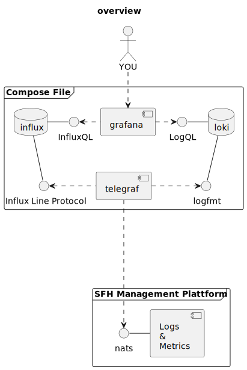

# SFH custom metrics example

This example project shows one way to store and browse logs and metrics streamed from the SFH management platform. On initialization it will start these preconfigured containers:

- **telegraf** that connects to the SFH Management Platform and streams logs and metrics into the dedicated databases
- **influxdb** to store and serve metrics data
- **loki** to store and serve logs
- **grafana** as frontend to browse logs and metrics stored in influx and loki

## usage

You need to provide the app-id of your application and a valid access-token. Later one you can obtain copied into your clipboard by pressing `t` while beeing logged in on the [SFH Management Platform](https://console.smartfactoryhost.com) or via your [user profile](https://console.smartfactoryhost.com/user/profile).

To start the example setup, run `docker compose up` with the required environment variables set accordingly.

- `APPID`: the numeric id of your sfh application
- `TOKEN`: the access token you can get from your [user profile](https://console.smartfactoryhost.com/user/profile)

```sh
TOKEN="<token>" APPID="<appId>" docker compose up
```

> ⚠️ In some cases, the influxdb fails to initialize. In such a case, stop the docker compose by pressing `<ctrl-c>` and start over with the command above.
>
> ⚠️ Be aware of the token you passed will become invalid after some minutes. So if you restart the compose file with a new token, you need to run `docker compose rm telegraf` first. Otherwise it will continue to use the old invalid token.

## exploring metrics

Point your browser to [grafana](http://localhost:33000/explore), login as user `admin` with password `password` and explore the data available.

## overview

The diagram below shows the containers set up after running `docker-compose up`.

